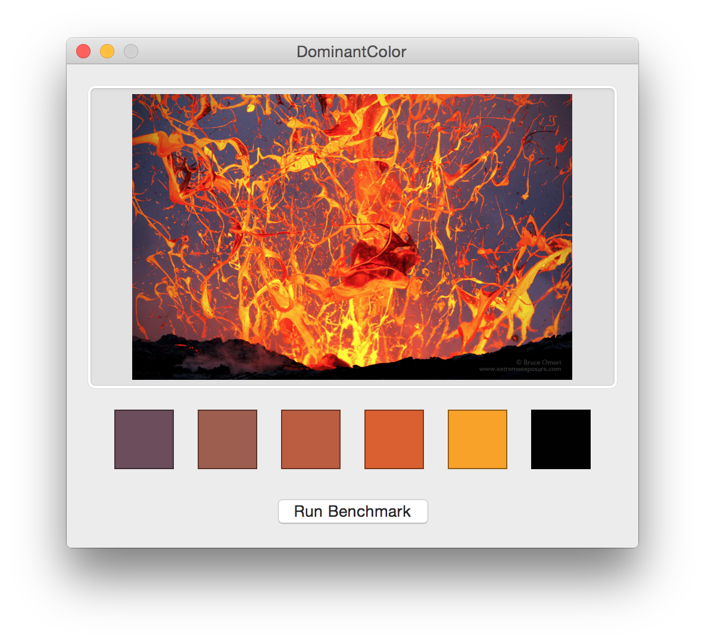

## DominantColor

Finding the dominant colors of an image using the YUV color space and the k-means clustering algorithm.

### Algorithm

#### Color Difference

The simplest and most commonly used metric[[1](http://en.wikipedia.org/wiki/Color_difference)] for the difference between two colors is the Euclidian distance between the colors on a 3-dimensional coordinate space. 

#### Color Space

The Euclidian distance between RGB colors doesn't accurately represent how humans perceive color differences, so I used the YUV color space instead, which takes human perception into account[[2](http://en.wikipedia.org/wiki/YUV)]. There are a number of other color spaces that could be used for this purpose as well, most notably a [Lab color space](http://en.wikipedia.org/wiki/Lab_color_space). Conversions to a Lab color space from RGB are non-trivial because RGB is device dependent, so I decided to stick with YUV for the time being.

#### Clustering (k-means)

Pixels are grouped into clusters of dominant colors using a standard k-means clustering algorithm[[3](http://en.wikipedia.org/wiki/K-means_clustering)][[4](http://users.eecs.northwestern.edu/~wkliao/Kmeans/)][[5](http://cs.smu.ca/~r_zhang/code/kmeans.c)]. 

##### Choosing K

The k-value was originally chosen based on the rule of thumb `k = sqrt(n/2)`[[6](http://en.wikipedia.org/wiki/Determining_the_number_of_clusters_in_a_data_set#cite_note-1)] but this resulted in `k`-values that were too large to run in a reasonable amount of time for large values of `n`. Right now, I'm using a magic value of `16` because empirical testing showed that it yielded the best results for many different images but I'm still looking into a number of more data-driven alternate approaches.

##### Selecting Initial Centroids

The initial centroids are currently selected on a random basis. An alternative approach is to use the [k-means++ algorithm](http://en.wikipedia.org/wiki/K-means%2B%2B), in which after the first centroid is selected randomly, the subsequent centroids are selected with probability proportional to the distance from the randomly selected centroid.

#### Downsampling

The k-means algorithm has a worst case runtime that is super-polynomial in the input size[[7](http://en.wikipedia.org/wiki/K-means%2B%2B)], so sampling large numbers of pixels is a problem. Images are automatically downsampled such that the total number of pixels is less than or equal to a specified maximum number of pixels to sample. The value I've been using is `1000`, which is a good balance between accurate results and runtime. 

### Implementation

Everything is implemented in Swift except for the functions that convert between RGB and YUV color spaces, which use GLKit and thus must be written in C (since Swift doesn't support C unions at this time). 

### App

The project includes a Mac app that can be used to see the results of the algorithm and to run a simple benchmark.

### Contact

* Indragie Karunaratne
* [@indragie](http://twitter.com/indragie)
* [http://indragie.com](http://indragie.com)

### License

Licensed under the MIT License.

### References

1 [http://en.wikipedia.org/wiki/Color_difference](http://en.wikipedia.org/wiki/Color_difference)  
2 [http://en.wikipedia.org/wiki/YUV](http://en.wikipedia.org/wiki/YUV)  
3 [http://en.wikipedia.org/wiki/K-means_clustering](http://en.wikipedia.org/wiki/K-means_clustering)    
4 [http://users.eecs.northwestern.edu/~wkliao/Kmeans/](http://users.eecs.northwestern.edu/~wkliao/Kmeans/)  
5 [http://cs.smu.ca/~r_zhang/code/kmeans.c](http://cs.smu.ca/~r_zhang/code/kmeans.c)  
6 [http://en.wikipedia.org/wiki/Determining_the_number_of_clusters_in_a_data_set#cite_note-1](http://en.wikipedia.org/wiki/Determining_the_number_of_clusters_in_a_data_set#cite_note-1)  
7 [http://en.wikipedia.org/wiki/K-means%2B%2B](http://en.wikipedia.org/wiki/K-means%2B%2B)